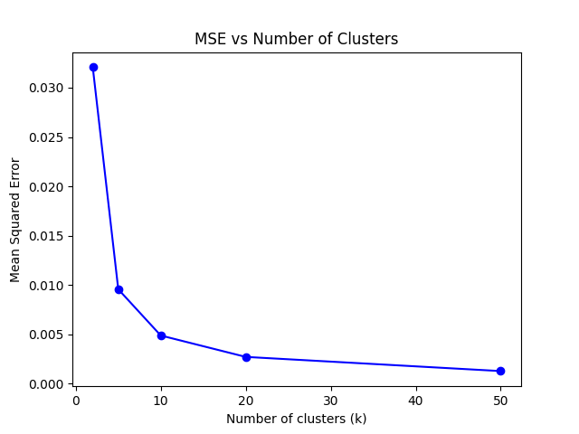

# 📘 E0-270 (O): Assignment 2 – K-Means Clustering for Image Compression

## 👤 Author
**Rishav Goswami**  
Master of Technology – AI  
Indian Institute of Science (IISc)  
Reg. No: 13-19-01-19-52-24-1-24708  
📧 `rishavg@iisc.ac.in`

---

## 📝 Project Overview

This project implements the **K-Means clustering algorithm from scratch using NumPy** to compress a 512×512 RGB image by reducing color space complexity. 
The image is reconstructed using various numbers of clusters (\(k = 2, 5, 10, 20, 50\)) to evaluate trade-offs between compression quality and computational cost.

Both **visual results** and **quantitative analysis (MSE)** are provided to assess performance.

---

## 📂 Files Included

| File                        | Description                                                                            |
|-----------------------------|----------------------------------------------------------------------------------------|
| `main.py`                   | Entry point to execute K-Means clustering                                              |
| `model.py`                  | Core implementation of the K-Means algorithm                                           |
| `utils.py`                  | Utilities for image handling, MSE calculation, plotting                                |
| `image_clustered_{k}.jpg`   | Output images compressed with \(k\) clusters                                           |
| `mse_vs_k.png`              | Plot of MSE against number of clusters                                                 |
| `report.tex` / `report.pdf` | Full LaTeX source and compiled report                                                  |
| `metrics.py`                | Collect metrics likes avg runtime, avg memory, mean mse, std mse etc for different k's |
| `README.md`                 | You're reading it!                                                                     |

---

## 🔍 Methodology Summary

- **Input**: RGB image of shape 512 × 512 × 3
- **Distance Metric**: Euclidean distance in RGB space
- **Key Steps**:
    1. Randomly select $k$ initial cluster centroids from pixel data
    2. Assign each pixel to the nearest centroid
    3. Update centroids to the mean of assigned pixels
    4. Iterate until centroid shifts < $10^{-6}$ or 100 iterations
- **Output**: New image with each pixel replaced by its cluster centroid
- **Evaluation Metric**:  
  $$
  \text{MSE} = \frac{1}{N} \sum_{i=1}^{N} \|x_i - c_i\|^2
  $$
  where $x_i$ is the original pixel and $c_i$ its cluster approximation

---

## 🛠️ How to run this code

1. Clone the repository:
    ```bash
    git clone <your-repo-url>
    cd <repo-directory>
    ```

2. Install dependencies:
    ```bash
    pip install numpy matplotlib pillow
    ```

3. Run the compression:
    ```bash
    python main.py
    ```

4. Output:
    - Clustered images saved as `image_clustered_{k}.jpg`
    - MSE plot saved as `mse_vs_k.png`

---

## 📊 Results Summary

- **Cluster values tested**: `k = 2, 5, 10, 20, 50`
- **Observation**:
    - MSE rapidly improves from `k = 2` to `k = 10`
    - After `k = 20`, the gains taper off (diminishing returns)
- **Recommendation**: `k = 20` offers ~83% of the improvement of `k = 50` at < 50% of the cost

<p>
  
</p>

---

## 🖼️ Output Images

Below are samples of clustered images for different \(k\) values:

| \(k\) Value | Compressed Image | Observation |
|------------|------------------|--------------|
| **k = 2**  |    | Highly posterized; only two dominant colors; severe detail loss |
| **k = 5**  |    | Better segmentation, but still banding and blockiness in gradients |
| **k = 10** |  | Good color recovery; textures start to appear more natural |
| **k = 20** |  | Major features well preserved; minor blurring in complex regions |
| **k = 50** |  | Visually very close to original; minimal quality loss to human perception |

> 🖌️ **Insight**: As \(k\) increases, the images preserve more texture and color nuance.

---

## 📌 Observations & Insights

- **Visual Quality** improves significantly between \(k = 2\) and \(k = 10\)
- **MSE Variation**: Small variations (±5%) can occur due to centroid initialization
- **Optimal Balance**: \(k = 20\) is a sweet spot for performance vs. quality
- **Limitations**:
    - K-Means struggles with fine textures and smooth gradients
    - Higher \(k\) increases computation and memory usage

---

## 📄 Report

For full technical details, results, and discussion, see [`report.pdf`](./report.pdf).

---

## 📬 Contact

For questions or feedback, feel free to reach out at:  
📧 **rishavg@iisc.ac.in**
